# Data model

Reference for the current Postgres schema. Source of truth is `src/lib/db/schema/`; this doc explains the shape, the key relationships, and the rationale that isn't obvious from the column list.

> Part of `docs/wiki/`. See `docs/wiki/index.md` for the full catalog and `docs/wiki/log.md` for the maintenance log. Per-chunk working notes (plans, decisions, research) live in `docs/chunks/YYYY-MM-DD-slug/`.

> **Vocabulary aligned to the [STAR Standard](https://www.starstandard.org/) (Standards for Technology in Automotive Retail) Domain Map.** Mapping:
> - `dealers` ← STAR *Dealer Profile* (Bounded Context 1, Party & Identity)
> - `contacts` ← STAR *Customer Profile* / *Party* root (BC 1) — every person known to the system, regardless of side. The single master person record.
> - `dealer_contacts` (junction) — them-side dealer↔contact relationships (free-text `title` + an `is_primary` quotes/MSAs recipient flag)
> - `team_member_roles` (junction) — us-side role assignments on a contact (STAR *Staff Member*, BC 12; `admin | staff | coach | viewer | dealer`)
> - `contact_identifiers` ← STAR *Identifier* (BC 7, Core & Common Entities)
> - `vehicles` ← STAR *Vehicle* (BC 2, Inventory & Vehicle Management)
> - `campaigns` ← STAR *Marketing Campaign* (BC 6, Marketing & Loyalty) — what we run for the dealer
> - `audience_sources` (lookup) — audience-source provenance for a dealer's marketing campaign (Dealer Database, PBS, Third Party List, Previous Buyers). Renamed from `sales_lead_sources` in 0038; the prior name carried three overloaded meanings (audience source, future per-campaign target table, dealership acquisition source) — see [`docs/wiki/log.md`](log.md) 2026-05-11 entry.
> - `service_items` (Salesability extension; no direct STAR mapping) — the quote-composer pricing catalog (`base-event`, `additional-contact`, `bdc-call`, …). Drives line-item generation in `src/lib/quotes/pricing.ts`. Not in STAR's domain map because it's our productized service catalog, not a vehicle/dealer/lead entity.

## Overview

Three things to know up front:

1. **One master person table — `contacts` — covers everyone.** Us-side staff and them-side dealer audiences are the same kind of entity (a person), distinguished only by their *role assignments*:
   - `team_member_roles` — us-side internal-app roles (`admin | staff | coach | viewer | dealer`). One row per (contact, role).
   - `dealer_contacts` — them-side per-dealer relationships (free-text `title` + an `is_primary` recipient flag). One row per (dealer, contact).

   A single contact can have rows in both tables (e.g. a coach we hired from a dealership: one `team_member_roles(role='coach')` row + one historical `dealer_contacts` row from the dealership-employment days). Identity is never duplicated. This mirrors STAR's *Party* root abstraction — every identity-bearing entity flows through one master record.

   **Every contact has at least one active role** (0023 Phase 5 invariant). The role is what classifies the person — admin, coach, dealer, etc. Enforced app-layer:
   - `createPerson` / `updatePerson` reject when the desired role set is empty (after the appAccess coercion that drops admin/coach without app access).
   - `createDealer` / `updateDealer` auto-assign `dealer` whenever a staff link is created (with `onConflictDoUpdate` un-archiving the role if it was previously archived).
   - The Phase 2 backfill (`scripts/backfill-dealer-role.ts`) ensured every existing dealer-side contact got a `dealer` row; re-running is a no-op.

   **Two carve-outs:**
   - `archivePerson` archives all active `team_member_roles` rows in a single tx. The contact stays unarchived (so historical FKs keep resolving), so it temporarily has zero active roles. The invariant is "every NEW or UPDATED contact carries a role," not "every active contact at every moment." Reactivating a person via `updateDealer` un-archives the dealer role per Phase 4's upsert.
   - `adoptOrphanAuthUser` creates a roleless stub contact for an orphan `auth.users` row (legacy-recovery path). The admin must edit the adopted person via `/admin/people` immediately afterward — the form's ≥1-role guard enforces a role pick.

   `dealer` is for them-side staff at customer dealerships and is filtered out of the staff-app gates (`is_staff_member()` SQL helper, `STAFF_APP_ROLES` constant in `src/lib/auth/load-team-membership.ts`, `requireStaffAccess()` page gate, `auth/callback` routing). Adding `dealer` to a contact does NOT promote them into the staff app.

   `contacts.user_id` (nullable, UNIQUE FK to `auth.users`) is the optional Supabase Auth link. It's populated for everyone with internal-app or dealer-portal access — typically every `team_member_roles` row implies a populated `user_id`, and most `dealer_contacts` rows do not (until a contact signs up to the portal). The schema does not enforce that coupling at the DB level — kept app-layer (Q #15) so we retain the flexibility to seed staff records ahead of provisioning, and so the deactivation flow can drop `app_metadata.role` and archive `team_member_roles` rows without orphaning the `contacts.user_id` link.

   `auth.users` itself is Supabase-managed and referenced via a Drizzle shadow declaration in `src/lib/db/schema/auth.ts` — never migrated.

2. **Domain rows are `bigint` IDs** via the `bigIdentity()` helper. There is no longer a uuid-PK domain table — `contacts.user_id` carries the auth uuid as a nullable FK rather than aliasing it as a PK. Tables exposed in dealer-portal URLs (`dealers`, `campaigns`) carry an additional `public_id` (nanoid 12-char URL-safe slug) for unguessable URLs — see *ID types* below.

3. **Audit columns are pervasive.** `timestamps` and `actors` (`created_by_id`, `updated_by_id` → `auth.users`) are mixins from `_columns.ts`, applied to every editable domain table. `archivable` (`archived_at`) is applied to most of them, but lifecycle-bearing tables (e.g. `campaigns` with its `status` enum, `master_service_agreements` with its `msa_status` enum) skip it — the lifecycle column carries terminal states like `cancelled` / `expired` / `terminated` instead. Lookup / catalog tables (`campaign_styles`, `audience_sources`, `service_items`) skip `actors` because they're admin-config, not domain data.

## Layout

The full entity-relationship map (Mermaid — renders on GitHub, VS Code, and mermaid.live). The ASCII diagrams that follow are domain-cluster zoom-ins.

```mermaid
erDiagram
    auth_users ||--o| contacts : "user_id · SET NULL · UNIQUE"
    auth_users ||--o{ audit_log : "actor_user_id · SET NULL"

    contacts ||--o{ contact_identifiers : "contact_id · CASCADE"
    contacts ||--o{ team_member_roles : "contact_id · CASCADE"
    contacts ||--o{ dealer_contacts : "contact_id · CASCADE"
    contacts ||--o{ vehicle_ownerships : "contact_id · CASCADE"
    contacts ||--o{ campaigns : "coach_id · SET NULL"
    contacts ||--o{ availability_blocks : "coach_id · CASCADE"

    dealers ||--o{ dealer_contacts : "dealer_id · CASCADE"
    dealers ||--o{ dealer_activities : "dealer_id · CASCADE"
    dealers ||--o{ campaigns : "dealer_id · RESTRICT"
    dealers ||--o{ quotes : "dealer_id · RESTRICT"
    dealers ||--o{ master_service_agreements : "dealer_id · RESTRICT"
    auth_users ||--o{ dealers : "owner_id · SET NULL"

    campaign_styles ||--o{ campaigns : "style_id"
    audience_sources ||--o{ campaigns : "audience_source_id"
    audience_sources ||--o{ quotes : "audience_source_id"
    campaigns ||--o{ billing_adjustments : "campaign_id · CASCADE"
    quotes ||--o| campaigns : "accepted_quote_id"
    campaigns ||--o{ quotes : "campaign_id · SET NULL (0093)"

    quotes ||--o{ quote_line_items : "quote_id · CASCADE"
    quotes ||--o{ quote_attachments : "quote_id · CASCADE"
    quotes ||--o{ quotes : "previous_quote_id · self · SET NULL"
    service_items ||--o{ quote_line_items : "service_item_id · SET NULL · nullable"

    vehicles ||--o{ vehicle_ownerships : "vehicle_id · CASCADE"

    auth_users {
        uuid id PK "Supabase-managed (shadow decl)"
    }
    contacts {
        bigint id PK
        text first_name
        text last_name
        text display_name "computed"
        uuid user_id FK "→ auth.users · UNIQUE · nullable"
    }
    contact_identifiers {
        bigint id PK
        bigint contact_id FK
        contact_identifier_kind kind "email | phone"
        text value
        boolean is_primary
    }
    team_member_roles {
        bigint id PK
        bigint contact_id FK
        team_member_role role "admin|staff|coach|viewer|dealer"
        text specialty
    }
    dealer_contacts {
        bigint id PK
        bigint dealer_id FK
        bigint contact_id FK
        boolean is_primary "quotes/MSAs recipient"
        boolean do_not_contact
        text title
    }
    dealers {
        bigint id PK
        text public_id "nanoid · UNIQUE · URL slug"
        text name
        text address
        ca_province province
        dealer_status status
        text acquired_via
        text phone "nullable · rooftop line"
        text manufacturer "nullable · brand"
        text notes "nullable"
        text quickbooks_id "nullable · UNIQUE partial"
        dealer_pipeline_stage pipeline_stage "nullable · 0087 funnel"
        dealer_priority priority "nullable · high|medium|low"
        uuid owner_id FK "→ auth.users · SET NULL · coach"
        text next_action "nullable · rep promise"
        date next_action_at "nullable · due date"
        timestamptz last_contacted_at "nullable · 0087"
        timestamptz stage_changed_at "nullable · read by 0088"
    }
    dealer_activities {
        bigint id PK
        bigint dealer_id FK "CASCADE"
        dealer_activity_kind kind "call|email|meeting|note|other"
        text note "nullable"
        timestamptz occurred_at "default now"
    }
    campaigns {
        bigint id PK
        text public_id "URL slug"
        bigint dealer_id FK
        bigint coach_id FK
        bigint style_id FK
        bigint audience_source_id FK
        bigint accepted_quote_id FK "→ quotes"
        date start_date
        date end_date
        campaign_status status "draft|booked|cancelled|completed"
        boolean msa_waived "0100 per-event MSA opt-out, default false"
    }
    billing_adjustments {
        bigint id PK
        bigint campaign_id FK
        text field "qty_records|sms_email|letters|bdc"
        integer value "≥ 0"
    }
    master_service_agreements {
        bigint id PK
        bigint dealer_id FK
        msa_status status "pending|active|expired|terminated"
        timestamp signed_at
        timestamp expires_at
        text provider_document_id
        text template_version
    }
    quotes {
        bigint id PK
        bigint dealer_id FK
        bigint audience_source_id FK
        bigint previous_quote_id FK "self · revision chain"
        quote_status status "draft|sent|accepted|declined"
        uuid accept_token "UNIQUE"
        numeric subtotal
        numeric tax
        numeric tax_override "0080: retained, unused"
        numeric tax_pct "province snapshot"
        numeric total
        jsonb inputs
    }
    quote_line_items {
        bigint id PK
        bigint quote_id FK
        bigint service_item_id FK "nullable · snapshot"
        text code
        text label
        integer qty
        numeric unit_price
        numeric override_unit_price
        numeric line_total
        integer display_order
    }
    quote_attachments {
        bigint id PK
        bigint quote_id FK "CASCADE"
        text filename
        text storage_key "GCS object key"
        text content_type
        integer byte_size
        integer display_order
    }
    service_items {
        bigint id PK
        text code "UNIQUE"
        text label
        numeric unit_price "nullable · blank = variable"
        text description
        text quickbooks_id "nullable · UNIQUE partial · QBO Item.Id"
    }
    vehicles {
        bigint id PK
        text vin
        integer year
        text make
        text model
        text trim
    }
    vehicle_ownerships {
        bigint id PK
        bigint vehicle_id FK
        bigint contact_id FK
        date acquired_at
        date sold_at "NULL = current owner"
    }
    availability_blocks {
        bigint id PK
        date start_date
        date end_date
        availability_block_kind kind "holiday|closure|coach_unavail"
        bigint coach_id FK "nullable"
        text region
    }
    audience_sources {
        bigint id PK
        text label "UNIQUE"
        integer sort_order
    }
    campaign_styles {
        bigint id PK
        text label "UNIQUE"
        integer sort_order
    }
    tax_rates {
        bigint id PK
        ca_province province "UNIQUE"
        text label
        numeric rate "combined % · QC 14.975"
    }
    audit_log {
        bigint id PK
        timestamp occurred_at
        uuid actor_user_id FK "nullable"
        text actor_role
        audit_action action
        text target_table
        bigint target_id
        jsonb payload
    }
```



> Deliberately not drawn: every editable domain table also has `created_by_id` / `updated_by_id` → `auth.users` (the `actors` mixin, `ON DELETE SET NULL`); and `tax_rates` has **no FK** — it joins logically by the `ca_province` enum (`quotes.tax_pct` is a point-in-time snapshot of the rate, not a live foreign key). (Chunk 0066 flattened `service_items` to a single `unit_price`, dropping the vestigial `unit` enum + `unit_price_min`/`unit_price_max` — the live quote path only ever read `unit_price`.)

### Cluster zoom-ins

```
                  ┌──────────────────────────┐
                  │   auth.users (Supabase)  │
                  └─────────────┬────────────┘
                                │ user_id (nullable, UNIQUE)
                                │ ON DELETE SET NULL
                                ▼
                         ┌──────────────┐
                         │   contacts   │  ← master person record
                         │              │     (everyone, both sides)
                         └──┬────────┬──┘
                            │        │
            us-side roles   │        │   them-side relationships
                            ▼        ▼
            ┌───────────────────┐   ┌──────────────────┐
            │ team_member_      │   │ dealer_contacts  │
            │ roles             │   │  is_primary      │
            │  role: admin /    │   │  + title (free)  │
            │  staff / coach /  │   │  + DNC, source,  │
            │  viewer           │   │    since, ...    │
            │  + specialty      │   │                  │
            │  (when coach)     │   └────────┬─────────┘
            └───────────────────┘            │ dealer_id
                                             ▼
                                        ┌─────────┐
                                        │ dealers │
                                        └────┬────┘
                                             │ dealer_id (RESTRICT)
                                             ▼
              ┌────────────────────────────────────────┐
              │              campaigns                 │
              │  status: draft → booked →              │
              │          cancelled / completed         │
              └────────────────┬──────────────┬────────┘
                               │              │
                       style_id│              │ audience_source_id
                               ▼              ▼
                      ┌────────────────┐  ┌────────────────────┐
                      │ campaign_styles│  │ audience_sources │
                      └────────────────┘  └────────────────────┘

   ┌─────────────────────────────────┐
   │      availability_blocks        │
   │  start_date, end_date (incl.)   │
   │  kind: statutory_holiday        │
   │      | company_closure          │
   │      | coach_unavailable        │
   │  coach_id? → contacts           │
   │  region? (e.g. CA-ON)           │
   └─────────────────────────────────┘
```

Contacts cluster (the master person record + its identifiers + its vehicles):

```
       ┌──────────────────────────┐
       │        contacts          │
       │  first/last name,        │
       │  display_name (computed),│
       │  user_id → auth.users    │
       │  (nullable, UNIQUE)      │
       └─┬─────────────────────┬──┘
         │                     │
         ▼                     ▼
   ┌──────────────────────┐   ┌────────────────────────────┐
   │ contact_identifiers  │   │     vehicle_ownerships     │
   │  kind: email|phone   │   │  (M:N over time;           │
   │  value, is_primary   │   │   acquired_at, sold_at)    │
   └──────────────────────┘   └─┬──────────────────────────┘
   (1:N — multiple                │
    contact channels)              ▼
                              ┌──────────┐
                              │ vehicles │
                              │ vin, yr, │
                              │ mk, mdl  │
                              └──────────┘

   Vehicles persist across owners; ownership rows close/open
   on transfer. One open (sold_at IS NULL) ownership per vehicle.
```

Edges left out of the diagrams for clarity:

- `campaigns.coach_id` → `contacts.id` (`ON DELETE SET NULL`). Expected to point at a contact with a `team_member_roles(role='coach')` row — enforced at the app layer, not by a CHECK.
- `availability_blocks.coach_id` → `contacts.id` (`ON DELETE CASCADE`). Set only when `kind='coach_unavailable'`; null for `statutory_holiday` and `company_closure`. Expected to point at a contact with `team_member_roles(role='coach')` — app-enforced.
- Audit columns: every editable domain table has `created_by_id` / `updated_by_id` → `auth.users` (`ON DELETE SET NULL`) via the `actors` mixin.

## Tables at a glance

| Table | PK | Key columns |
|---|---|---|
| `auth.users` | `id` uuid | (Supabase-managed; identity only) |
| `contacts` | `id` bigint | `first_name`, `last_name`, `display_name` (computed), `user_id` (FK auth.users, nullable, UNIQUE) — master person record, both sides |
| `team_member_roles` | `id` bigint | `contact_id` (FK contacts, cascade), `role` enum (`admin\|staff\|coach\|viewer\|dealer`), `specialty` (nullable, used when `role='coach'`) — UNIQUE on `(contact_id, role)` |
| `dealer_contacts` | `id` bigint | `dealer_id` (FK dealers), `contact_id` (FK contacts), `is_primary` boolean (0089 — quotes/MSAs recipient; UNIQUE `(dealer_id)` partial `WHERE is_primary AND archived_at IS NULL`), `do_not_contact`, `since` date, `source` text, `last_contacted_at`, `title` text (free-text job title). The legacy `role` enum was dropped in 0089 |
| `contact_identifiers` | `id` bigint | `contact_id` (FK contacts, cascade), `kind` enum (`email\|phone`), `value` (normalized), `is_primary` |
| `dealers` | `id` bigint | `public_id` (nanoid, UNIQUE), `name`, `address` (city-only for BD-list prospects, 0086), `province` enum (`ca_province`: 13 CA province/territory codes, **nullable** — drives quote sales tax, 0065), `status` enum (`prospect\|active`, default `active`), `acquired_via` text (nullable; `'Atlantic Canada BD list'` for the 0086 import batch), `phone` text (nullable, 0086 — rooftop switchboard line; a **dealer-level** attribute, NOT a contact identifier, since rooftops share numbers the `contact_identifiers` active-unique index forbids; the QBO push prefers it for the Customer `PrimaryPhone`), `manufacturer` text (nullable, 0086 — vehicle brand, free-form e.g. "FCA"/"Ford/Lincoln"/"General Motors"), `notes` text (nullable, 0086 — free-form; the BD import folds Group/Contact-Verification/Co-op/sheet-notes into a readable block), `quickbooks_id` text (nullable, **UNIQUE partial index** `WHERE quickbooks_id IS NOT NULL` — durable link to the QBO `Customer.Id`, 0069; written **both directions**: backfilled by the QBO→app sync at `/admin/quickbooks` (0069) and by the app→QBO **Push to QuickBooks** action on `/dealerships/[id]` (0070 — create-a-Customer-then-backfill, or update-if-already-linked). **As of 0084 the push is also automatic + best-effort** (the app is the dealer master): creating an **active** dealer, flipping a prospect active (`convertProspectToActive`), or **editing** an active-or-linked dealer auto-runs the 0070 push from inside `createDealer`/`convertProspectToActive`/`updateDealer` — a dormant/erroring QuickBooks (or an Intuit 6240 duplicate-name) never blocks the dealer save, leaving it unlinked. Prospects don't push. The pushed `Customer` now also carries the primary contact's `GivenName`/`FamilyName` (0084), not just company + email/phone. The QB→app **Sync stays non-clobbering** — it only creates QB-only dealers + links, never overwriting app data). **Prospecting pipeline (0087, all nullable):** `pipeline_stage` enum (`dealer_pipeline_stage`, 9 stages new→lost; won is not a stage), `priority` enum (`dealer_priority`: high/medium/low), `owner_id` (FK auth.users, SET NULL — coach picklist), `next_action` text + `next_action_at` date (commitment queue), `last_contacted_at` + `stage_changed_at` timestamptz (the latter read by 0088). See the *Prospecting pipeline* prose under [Dealers](#dealers) |
| `dealer_activities` | `id` bigint | `dealer_id` (FK dealers, **CASCADE**), `kind` enum (`dealer_activity_kind`: `call\|email\|meeting\|note\|other`), `note` text (nullable), `occurred_at` timestamptz (default now) + `actors`/`timestamps` — per-dealer touch log (0087); `logDealerActivity` inserts + stamps `dealers.last_contacted_at`. Composite index `(created_by_id, occurred_at)` + `(dealer_id)`. RLS-on (service_role + staff) |
| `service_items` | `id` bigint | `code` (UNIQUE), `label`, `unit_price` numeric(10,2) (nullable; blank = "variable"), `description`, `sort_order`, `quickbooks_id` text (nullable, **UNIQUE partial index** `WHERE quickbooks_id IS NOT NULL`, 0071) — flat quote-composer catalog (0066 dropped the legacy `unit` enum + `unit_price_min`/`max`). **As of 0071, QuickBooks is the item master:** this catalog is a read-through mirror of the connected QBO company's Items, populated only by the on-demand **Sync** action on `/admin/quickbooks` (create / overwrite-from-QBO / archive QBO-removed / hard-delete legacy unlinked; 0083 folded the former "Pull items" button into the one Sync button). **No in-app item CRUD** — the `/admin/lookups` catalog editor + the `createServiceItem`/`updateServiceItem`/`archiveServiceItem` actions were removed. See [`commercial-spine.md`](commercial-spine.md) |
| `vehicles` | `id` bigint | `vin` (UNIQUE, normalized), `year`, `make`, `model`, `trim` — one row per physical vehicle, persists across owners |
| `vehicle_ownerships` | `id` bigint | `vehicle_id` (FK vehicles), `contact_id` (FK contacts), `acquired_at`, `sold_at` (nullable) — junction; one open ownership per vehicle |
| `campaigns` | `id` bigint | `public_id` (nanoid, UNIQUE), `dealer_id` (FK), `coach_id` (FK contacts, expected `team_member_roles(role='coach')`), `style_id` (FK), `audience_source_id` (FK — slated to move to `quotes` once the booking-form/composer flow is reconciled), `start_date`, `end_date`, `status` enum (`draft\|booked\|cancelled\|completed`), `accepted_quote_id` (FK `quotes`, nullable; the contract that spawned this delivery), `msa_waived` boolean (NOT NULL default `false`, migration `0048` — **0100 per-event MSA opt-out**: a waived event reads "MSA — Not required" and its quote accepts with no active MSA; see [`commercial-spine.md`](commercial-spine.md)), plus inline day-of contact fields and service flags (see `campaigns` section below). Commercial columns (`fee`, `travel`, `deposit_pct`, `tax_pct`, `quote_valid_days`) live on `quotes` per [`commercial-spine.md`](commercial-spine.md) — dropped from `campaigns` in 0037 Phase 4. **Google Calendar projection (0077, migration `0037`):** `gcal_event_id` text (nullable, **UNIQUE partial index** `WHERE … IS NOT NULL` — the durable link to the projected event), `gcal_sync_status` enum (`pending\|synced\|failed`, default `pending`), `gcal_synced_at` timestamptz. See [`calendar-distribution.md`](calendar-distribution.md). |
| `campaign_styles` | `id` bigint | `label` (UNIQUE), `sort_order` |
| `audience_sources` | `id` bigint | `label` (UNIQUE), `sort_order` |
| `tax_rates` | `id` bigint | `province` enum (`ca_province`, UNIQUE), `label`, `rate` numeric(6,3) (combined GST/HST/PST/QST percent — QC is 14.975), seeded with all 13 provinces (0065). **QuickBooks is the source of truth for `rate`; the province → QB-tax-code MAPPING is managed explicitly on `/admin/lookups` (0076).** An admin picks each province's QBO `TaxCode` from a dropdown — single or **group** code (`resolveCodeRatePct` sums a group's components: QC's GST 5% + QST 9.975% = 14.975%, BC's GST+PST) — which sets `quickbooks_tax_code_id` + **adopts that code's rate** into `tax_rates.rate` (`assignProvinceTaxCode`). A **"Refresh rates"** action (`refreshTaxRates`) re-syncs the rates of already-mapped provinces (rate-only — never re-maps). The 0075 name heuristic survives only as a dropdown **suggestion** (`resolveProvinceLinksByName`); its auto-apply **"Pull tax codes" button was retired (0076)** because it mis-mapped real data (NS's stale `HST NS` 15% vs `HST NS 2025` 14%; the shared `HST Atlantic 15%` code). The free-rate editor stays removed (0075). `quickbooks_tax_code_id` text (nullable, 0074) — a province is **"QB-managed" ⇔ this is non-null** (no flag column; all 13 rows kept — managed/unmanaged is presentational, per `0076/decision.md`); drives the Estimate push's per-line `TaxCodeRef`. **Null = unmanaged:** the province keeps its seeded `rate` as a fallback (quote tax still computes — no silent $0), but a **taxed** quote there fails the push pre-flight ("map it on the Lookup Admin page"). The app's flat-rate total is the customer **preview**; QuickBooks computes the authoritative tax from the code and posts GST/QST to separate GL accounts at invoice time (Estimates are non-posting). _Pending verify:_ a group-code (QC) Estimate push computing both components live (0074 only live-tested single-rate ON; needs QC set up in the QB company first). |
| `billing_adjustments` | `id` bigint | `campaign_id` (FK campaigns, cascade), `field` text (CHECK in `qty_records\|sms_email\|letters\|bdc`), `value` integer (CHECK ≥ 0), UNIQUE(`campaign_id`,`field`) — per-campaign billing override layer for `/reports`; the campaign column stays the source of truth (clear = delete = revert). See `billing_adjustments` section below + [`auth.md`](auth.md) (`reports:edit-billing`). |
| `master_service_agreements` | `id` bigint | `dealer_id` (FK dealers), `status` enum (`pending\|active\|expired\|terminated`), `signed_at`, `expires_at`, `signed_pdf_storage_key`, `provider_document_id`, `termination_notice_date`, `termination_effective_date`, `template_version` — per-Client 12-month commercial frame; see [`commercial-spine.md`](commercial-spine.md) |
| `quotes` | `id` bigint | `dealer_id` (FK dealers), `status` enum (`draft\|sent\|accepted\|declined`), `accept_token` (uuid UNIQUE), `pdf_storage_key`, `inputs` jsonb, `fee` / `travel` / `deposit_pct` / `quote_valid_days`, `tax_pct` numeric(6,3) (0065: snapshot of the dealer's province rate; widened from 5,2), `tax_override` numeric(12,2) **nullable** (0065 coach's manual tax — **retained-but-unused as of 0080**: the override write path was removed, the column is kept for pre-0080 historical overrides + the QB-push guard, droppable later), `audience_source_id` (FK), `subtotal` / `tax` / `total` numeric(12,2), `previous_quote_id` (self-FK), `sent_at` / `accepted_at` / `declined_at`, `quickbooks_estimate_id` text (nullable, **UNIQUE partial index** `WHERE … IS NOT NULL`, 0073 — durable link to the QBO `Estimate.Id`; set only by the "Push to QuickBooks" action on `/quotes/[id]`; present → update the Estimate, null → create+backfill, giving push idempotency) — per [`commercial-spine.md`](commercial-spine.md); the accepted Quote IS the contract per MSA §1.iii. **Tax model (0065 → 0080):** `tax = round(subtotal × tax_pct/100)`; the rate comes from the dealer's `province` → `tax_rates`. **0080 removed the per-quote manual override** — QuickBooks owns the rate (0075/0076) and an overridden quote couldn't be pushed to QB, so tax is always the auto province-rate computation (the composer Tax field is display-only). **Estimate push (0073 + 0074 tax):** admin-only push of a `sent`/`accepted` quote → QBO Estimate (`src/lib/quickbooks/quote-push.ts`), `CustomerRef` from `dealers.quickbooks_id` + each line's `ItemRef` from `service_items.quickbooks_id` + tax via a **per-line** `SalesItemLineDetail.TaxCodeRef` from the province's `tax_rates.quickbooks_tax_code_id` (QBO computes the tax — a bare `TotalTax` override is dropped per the 0073 smoke, and a txn-level code alone fails QBO-CA error 6000 "every line needs a GST/HST rate" per the 0074 live smoke). Pre-flight (fails closed): dealer + every line SKU QBO-linked; a taxed quote's province must be mapped to a tax code; a manual `tax_override` is rejected (0080 removed the write path, so this only ever blocks a pre-0080 historical quote); and a rate-drift guard rejects a quote whose snapshotted tax ≠ the current province rate. |
| `quote_attachments` | `id` bigint | `quote_id` (FK quotes, **CASCADE**), `filename`, `storage_key` (GCS object key, `quotes/{id}/attachments/{uuid}-{filename}`), `content_type`, `byte_size` integer, `display_order` integer — supporting documents a coach uploads on the send dialog to ride alongside the quote PDF in the outgoing email (0078, migration `0038`). Index on `(quote_id, display_order)`. RLS: service_role + staff (matches `quote_line_items`). Caps: ≤10 MB/file, ≤20 MB total payload; allowlist = PDF / PNG / JPG / WEBP / docx / xlsx (`src/features/quotes/attachments.ts`). Retention = keep-forever in GCS (no background GC). See [`commercial-spine.md`](commercial-spine.md). |
| `availability_blocks` | `id` bigint | `start_date`, `end_date` (inclusive), `kind` enum (`statutory_holiday\|company_closure\|coach_unavailable`), `coach_id` (FK contacts, nullable; required when `kind='coach_unavailable'`), `region` (nullable, e.g. `CA-ON`), `reason`, `source` |
| `sms_recipients` | `id` bigint | `campaign_id` (FK campaigns, **CASCADE**), `phone` (E.164, CHECK-guarded), `first_name`/`last_name` (nullable), `consent_basis` enum (`sms_consent_basis`: `express\|implied_purchase\|implied_inquiry`), `last_contact_at` date (nullable — implied basis without it = never sendable). UNIQUE `(campaign_id, phone)`; index on `created_at` (import date drives the **24-month retention hard-delete**, `scripts/purge-sms-recipients.ts`). Per-campaign import of the DEALER's list — 0103, see [`sms.md`](sms.md) |
| `sms_sends` | `id` bigint | `campaign_id` (FK campaigns, **RESTRICT** — ledger anchor), `body` text (the template, stored ONCE — never per-recipient-rendered, so no customer names survive the purge), `total_recipients`/`excluded_opt_out`/`excluded_stale_consent` integers (pre-send review snapshot). One row per launch; `created_at`/`created_by_id` = launch time/actor (0103) |
| `sms_messages` | `id` bigint | `send_id` (FK sms_sends, RESTRICT), `recipient_id` (FK sms_recipients, **SET NULL** — survives the purge), `phone` (snapshot, CHECK-guarded), `provider_sid` (Twilio SM…, UNIQUE partial `WHERE NOT NULL`), `status` enum (`sms_message_status`: `queued\|sent\|delivered\|undelivered\|failed`), `error_code`, `status_updated_at`. Permanent per-message delivery ledger (CASL defense record); machine-written, no `actors` (0103) |
| `sms_opt_outs` | `id` bigint | `phone` (E.164, UNIQUE, CHECK-guarded), `source` enum (`sms_opt_out_source`: `stop_reply\|manual`), `opted_out_at`, `provider_message_sid` (inbound STOP evidence, nullable). **PERMANENT global registry** — never purged; enforced on every send across all campaigns (0103) |

## Relationships

Identity / auth:

- `auth.users` 1:0..1 `contacts` via `contacts.user_id` — optional auth link, populated for anyone with internal or portal access. UNIQUE so a person can't link to two contacts. `ON DELETE SET NULL` (deleting an auth user revokes access but doesn't delete the contact, who may still be a dealer's customer or otherwise referenced).

Role assignments:

- `contacts` 1:* `team_member_roles` — us-side roles. UNIQUE `(contact_id, role)` enforces one row per (person, internal role); a person can hold multiple internal roles by holding multiple rows (e.g. admin + coach). `ON DELETE CASCADE`.
- `dealers` *:* `contacts` via `dealer_contacts` — them-side. One row per (dealer, contact); a partial-unique index allows at most one active `is_primary` contact per dealer. `ON DELETE CASCADE` on both sides.

Domain edges:

- `dealers` 1:* `campaigns` via `campaigns.dealer_id` — booking owner. `ON DELETE RESTRICT`.
- `contacts` 0..1:* `campaigns` via `campaigns.coach_id` — assigned coach (expected `team_member_roles(role='coach')`, app-enforced). `ON DELETE SET NULL`.
- `campaign_styles` 1:* `campaigns` via `campaigns.style_id`.
- `audience_sources` 1:* `campaigns` via `campaigns.audience_source_id`.
- `contacts` 0..1:* `availability_blocks` via `availability_blocks.coach_id` — per-coach unavailability (expected `team_member_roles(role='coach')`, app-enforced; null for `statutory_holiday` and `company_closure` rows). `ON DELETE CASCADE` — a hard-deleted coach takes their unavailability rows with them.
- `dealers` 1:* `master_service_agreements` via `master_service_agreements.dealer_id` — per-Client 12-month commercial frame. `ON DELETE RESTRICT` — never orphan an MSA; archive the dealer instead. At most one row in `status='active'` per dealer is an app-layer invariant (no DB-level partial unique today). See [`commercial-spine.md`](commercial-spine.md).
- `dealers` 1:* `quotes` via `quotes.dealer_id` — every Quote belongs to one Client. `ON DELETE RESTRICT`. Note the FK direction here: Quote knows its Dealer, not the reverse.
- `master_service_agreements` ⟷ `quotes` — **no FK** (the `quotes.msa_id` column was dropped in 0082). The two are independent; the accept gate looks up the dealer's `active` MSA at accept time (`acceptQuote`), not via a row link. See [`commercial-spine.md`](commercial-spine.md) → "Accepting a Quote".
- `audience_sources` 0..1:* `quotes` via `quotes.audience_source_id` — the consumer-audience source the Quote priced against; nullable for v1.
- `quotes` 1:* `quote_attachments` via `quote_attachments.quote_id` — supporting documents a coach uploads to ride alongside the quote PDF in the send email (0078). `ON DELETE CASCADE`. Self-contained snapshot (`filename`/`content_type`/`byte_size`); bytes live in GCS at `storage_key` (`quotes/{id}/attachments/{uuid}-{filename}`); `display_order` sets the email-attachment order. The reusable document-library FK (`document_id`) is 0079's additive extension, not here.
- `quotes` 0..1:* `quotes` via `quotes.previous_quote_id` — revision chain (self-FK, nullable). `ON DELETE SET NULL`. New revisions are new rows; the prior row is pinned by its rendered PDF.
- `quotes` 0..1:1 `campaigns` via `campaigns.accepted_quote_id` — **FK lives on `campaigns`, not `quotes`.** Written at quote-accept by `applyAcceptedQuoteToCampaign` (0094 — the column was declared since 0037 but not populated by any code until then); the Quote is the commercial record, the campaign is the Event being run. See [`commercial-spine.md`](commercial-spine.md).
- `campaigns` 1:* `billing_adjustments` via `billing_adjustments.campaign_id` — per-campaign billing overrides for `/reports` (0059). `ON DELETE CASCADE`. At most one row per (`campaign_id`, `field`) (UNIQUE). The campaign column is the source of truth; the adjustment is an additive overlay (`coalesce(override, campaign.value)`), and clearing it deletes the row.
- `campaigns` 1:* `sms_recipients` (CASCADE) and 1:* `sms_sends` (RESTRICT) — the imported dealer list is disposable per-campaign data; the send ledger is permanent compliance evidence (0103). `sms_sends` 1:* `sms_messages` (RESTRICT); `sms_recipients` 0..1:* `sms_messages` via `sms_messages.recipient_id` (**SET NULL** — the 24-month recipient purge nulls the link while the message keeps its `phone` snapshot). `sms_opt_outs` has no FKs by design — a bare phone-number registry that outlives everything. See [`sms.md`](sms.md).

Contact edges:

- `contacts` 1:* `contact_identifiers` — multiple emails / phones per contact. Partial unique on `(kind, value)` `WHERE archived_at IS NULL` enforces one contact per active identifier (strict-key dedup boundary).
- `contacts` *:* `vehicles` via `vehicle_ownerships` — many-to-many over time: one person can own multiple vehicles, and one vehicle changes owners as it's sold. `vehicle_ownerships` carries `acquired_at` / `sold_at`; the partial unique `(vehicle_id) WHERE sold_at IS NULL` enforces one current owner per vehicle.

Audit edges (every editable domain table):

- `created_by_id`, `updated_by_id` → `auth.users` — `ON DELETE SET NULL`. Applied to `contacts`, `team_member_roles`, `dealer_contacts`, `contact_identifiers`, `dealers`, `vehicles`, `vehicle_ownerships`, `campaigns`, `master_service_agreements`, `billing_adjustments` via the `actors` mixin. Lookup tables skip this.

## Identity & people

The model has **one master person record (`contacts`)** for everyone — us-side staff and them-side dealer audiences alike. Relationships live in two parallel junction tables: `team_member_roles` (us-side, a role enum + per-role state) and `dealer_contacts` (them-side, a contact-FK + per-relationship state: `title`, `is_primary`, DNC, …). This mirrors STAR's *Party* abstraction (BC 1's "source of truth for all identities: Staff, Customer, Vendor, Organization, Dealer") and ensures a single person who plays multiple roles — across sides or across dealers — never has duplicated identity.

### `auth.users` (Supabase)

Identity only. Owned by Supabase Auth — never declared, migrated, or written to from app code. Drizzle has a shadow declaration in `auth.ts` exposing the `id` column so other tables can FK to it. The `db-conventions` skill notes a drizzle-kit gotcha: generation emits `CREATE SCHEMA "auth"` and `CREATE TABLE "auth"."users"` despite `schemaFilter: ['public']` — those two statements get stripped from the generated SQL before it's applied.

### `contacts` — master person record

One row per person, ever, across all roles and all dealers.

Columns:

- `first_name`, `last_name` — display fields, not used for dedup
- `display_name` (computed) — human-readable label for UI
- `user_id` (FK `auth.users`, nullable, UNIQUE) — set when this person has internal-app or portal access. Populated for everyone in `team_member_roles` (in practice; not enforced by DB); populated for portal-using customers; null for everyone else. `ON DELETE SET NULL` on the auth side (deleting the auth user revokes access but preserves the person record).
- mixins: `timestamps`, `actors`, `archivable`

Deliberately thin. Per-side state, contact channels, and vehicles all live in their own tables so a single contact can have many of each.

The signup-trigger pattern depends on email confirmation: magic link confirms by definition; for Google OAuth, Supabase trusts Google's `email_verified` claim — fine for Workspace/Gmail. The trigger looks up a `contact_identifiers` row matching the new `auth.users.email` and back-fills `contacts.user_id` on the matching contact. One trigger covers staff and customers alike; differentiation happens via which role-junction has rows for that contact.

### `team_member_roles` — us-side role assignments

The internal-team analogue of `dealer_contacts`. One row per (contact, role).

- `contact_id` (FK contacts, `ON DELETE CASCADE`)
- `role` enum: `admin | staff | coach | viewer | dealer`
- `specialty` text (nullable) — coach-only field, e.g. "lease retention", "service drive". Sparse on non-coach rows; pragmatic over a separate `coach_details` side table at this scale (same trade-off as `dealer_contacts.title` for staff rows).
- mixins: `timestamps`, `actors`, `archivable`

UNIQUE `(contact_id, role)` enforces one row per (person, internal role). Multi-role internal staff (e.g. an admin who also coaches) hold multiple rows. This is a structural change from the prior single-`role` enum on `team_members` and dissolves what was open Q #3. (The them-side `dealer_contacts` table, by contrast, is one row per (dealer, contact) — its `role` enum was retired in 0089.)

Coaches are not a separate table — a coach is a `contacts` row with one `team_member_roles(role='coach')` row. `campaigns.coach_id` references `contacts.id`; the role is verified at the app layer (a CHECK would need a cross-table predicate).

Login routing: any `team_member_roles` row → internal app; otherwise, portal access via `dealer_contacts`. A contact who somehow holds rows in both (e.g. a coach we hired from a dealership who's still listed in `dealer_contacts` historically) routes to the internal app.

### `dealer_contacts` — dealer ↔ contact (many-to-many)

A `dealer_contacts` row is **"a person at this dealership."** The same person can be related to multiple dealers. `dealer_contacts` is the junction:

- `dealer_id` (FK dealers, `ON DELETE CASCADE`)
- `contact_id` (FK contacts, `ON DELETE CASCADE`)
- `is_primary` boolean (0089, default false) — the **explicit primary-contact designation**: the person who receives this dealer's quotes/MSAs. At most one active primary per dealer (partial-unique index below). This is the *only* "what's special about this contact" flag — see the role-retirement note below.
- `do_not_contact` boolean — dealer-scoped opt-out (CASL is brand-scoped; consent doesn't propagate across dealers).
- `since` (date) — when this relationship started
- `source` text — provenance of the relationship (import, manual entry, campaign N, dealership HR)
- `last_contacted_at` (nullable) — for cross-campaign suppression
- `title` text (nullable) — free-text job title at the dealer (e.g. "General Manager" / "Sales Manager", set by the 0091 Atlantic refresh). The durable home for "what they do."
- mixins: `timestamps`, `actors`, `archivable`

Indexes:

- UNIQUE `(dealer_id)` `WHERE is_primary AND archived_at IS NULL` (0089) — at most one **active** primary contact per dealer. Scoped to non-archived rows so an archived former-primary never blocks designating a new one.
- Index on `(dealer_id)` for "list this dealer's contacts".
- Index on `(contact_id)` for "show all dealers for this person".

**Role enum retired (0089).** Earlier this table carried a `role` enum (`customer | staff | prospect`). It was a category error: the *dealership* is the customer (`dealers.status`), `prospect` was dead (0 rows; `dealers.status='prospect'` already carries it), and `staff` was overloaded — it collided with the us-side `team_member_roles` meaning (a Salesability employee) while here it just meant "a person at the dealer." Reads were a priority heuristic (`staff > customer > prospect`) used only to guess the dealer's primary contact. Chunk 0089 replaced that guess with the explicit `is_primary` designation (expand→migrate→contract: add+backfill in `0043`, migrate reads, drop the column + `dealer_contact_role` enum in `0044`). The backfill reproduced each dealer's then-displayed priority-primary so nothing visibly moved, converging on the 0091 GM where one was set (verified: 165/165 GM-titled dealers kept the GM as primary). "What they do" now lives in free-text `title`; "who we send to" is `is_primary`.

### Why one master person table, not two

Earlier drafts of this doc had `team_members` (us-side) as a separate table from `contacts` (them-side). The split looked clean but introduced asymmetry: a person who happened to be both us-staff and a dealer's customer (e.g. a coach we hired from a dealership) had to exist as two rows with no link between them. STAR's *Party* root explicitly covers Staff and Customer under the same umbrella; we now do the same.

Both sides are thin contact-FK junctions with per-relationship state: `team_member_roles` keeps a role enum (one row per internal role), while `dealer_contacts` is one row per (dealer, contact) carrying `title` + `is_primary` (its role enum was retired in 0089). Either way, "what does this person do for us / for them" is a query against one of the two junctions, and a single person who plays multiple roles — across sides or across dealers — never has duplicated identity.

The trade-off vs the old shape:

- **Lost:** the `team_members.id = auth.users.id` cascade-delete pattern. Auth-user deletes now `SET NULL` on `contacts.user_id` rather than cascading the person record away — which is *more* correct, since the person may still be a dealer's customer.
- **Gained:** symmetry, no identity duplication for cross-side people, multi-role internal staff for free, and STAR-pure modeling of identity.

## Dealers

### `dealers` — paying companies (typically dealerships)

Identity columns are `name` + `address`; contacts and channels live in `dealer_contacts` / `contact_identifiers`. The legacy app flattened the company and primary contact into a single row (`name | contact | phone | email | address`); the new schema does **not** — dealers have many contacts (via `dealer_contacts`), contacts can change role over time, and a portal user has to be a person rather than a company. Org-level `email` / `phone` are intentionally absent until there's a clear use (switchboard line, billing alias) — push contact info down to `contacts`/`contact_identifiers` by default.

Lifecycle columns (added 0035 Phase 2):

- `status` enum (`prospect | active`, NOT NULL DEFAULT `active`) — funnel stage. `prospect` = a quote has been drafted but no signed relationship yet; `active` = quote accepted (or admin manually flipped via `convertProspectToActive`). The `/dealerships` filter pills surface Active / Prospect / Archived (admin-gated; coaches do not have `dealer:create`). DealerForm accepts a `defaultStatus='prospect'` prop intended for an inline-create affordance inside the quote composer's dealer picker — the entry point itself is **deferred** until a richer picker component lands (Combobox primitive doesn't support inline-add). Indexed (`dealers_status_idx`) for the filter-pill counts.
- `acquired_via` text (nullable) — free-form provenance of *how the dealership found Salesability* (`"Book Your Event form"`, `"referral"`, `"trade show"`, `"outbound"`). Distinct from `audience_sources` (which provides the per-campaign consumer list). Free-form in v1; formalize to a lookup table once web intake lands and the values stabilize.

**Archived state is orthogonal to `status`.** A dealer is archived iff `archived_at IS NOT NULL`, independent of whether `status='prospect'` or `'active'`. The /dealerships filter pills compute: Active = `status='active' AND archived_at IS NULL`; Prospect = `status='prospect' AND archived_at IS NULL`; Archived = `archived_at IS NOT NULL` (status ignored). Keeps the existing `archivable` mixin authoritative — see 0035 plan Open Question #1.

Update-action concurrency: `updateDealer` is patch-style on `status` and `acquired_via` — omitted-from-FormData fields don't appear in SET, so a concurrent `convertProspectToActive` flip can't be clobbered by a stale edit. The status transition action itself is a guarded UPDATE keyed on `(id, status='prospect', archived_at IS NULL)` — idempotent on already-active or archived rows.

The table is named `dealers` (matching the STAR Standard's *Dealer Profile* noun). The 99% case is automotive dealerships; STAR's umbrella also covers marine, powersports, medium/heavy-duty trucks, and construction equipment dealers, so the name holds even if we expand beyond cars.

#### Prospecting pipeline (added 0087)

Layered onto `dealers` to give reps a place to keep the small promises that win trust ("call Tuesday", "send pricing Friday") — see [0087 intent](../chunks/closed/0087-dealer-pipeline/intent.md). **All columns are nullable**: active/existing dealers don't need a funnel position; the 188 cold Atlantic prospects (0086) were backfilled to `pipeline_stage='new'` in `drizzle/0042_low_slipstream.sql`.

- `pipeline_stage` enum (`dealer_pipeline_stage`: `new · researching · contacted · follow_up · meeting_booked · proposal_sent · negotiation · on_hold · lost`) — funnel position. Enum order = funnel order. **Won is NOT a stage** — winning a prospect is `status='active'` via `convertProspectToActive` (+ the 0084 QBO push), so the pipeline and the commercial spine stay one system. `on_hold`/`lost` ARE stages (so the 0088 dashboard counts them); `lost` does NOT auto-archive. Indexed (`dealers_pipeline_stage_idx`).
- `priority` enum (`dealer_priority`: `high · medium · low`) — rep-set work priority.
- `owner_id` (uuid FK → `auth.users`, `ON DELETE SET NULL`) — the coach who owns working this dealer. The **picklist is coaches-only** (0087 decision D2), enforced at the Server Action / picklist layer; the FK stays generic `auth.users` so a future widen to all-staff needs no migration. Indexed (`dealers_owner_id_idx`).
- `next_action` text + `next_action_at` date — the rep's current promise (their words) and its due date. Drives the `/dealerships` **commitment queue**: overdue (loud) / due-soon / idle (no next action). `next_action_at` is indexed (`dealers_next_action_at_idx`) for the queue sort.
- `last_contacted_at` timestamptz — stamped by `logDealerActivity` on the last logged touch (distinct from the per-contact `dealer_contacts.last_contacted_at`).
- `stage_changed_at` timestamptz — stamped on every `pipeline_stage` change. Written by 0087; **read by the 0088 dashboard's "stalled in stage" blocker** (added now so 0088 needs no migration).

`setDealerPipeline` patches these (omit-when-absent, like `updateDealer`) and stamps `stage_changed_at` on a stage transition; both are `dealer:edit`-gated.

### `dealer_activities` — per-dealer touch log (added 0087)

One row per logged touch (call / email / meeting / note / other). `logDealerActivity` (`dealer:edit`) inserts a row AND stamps `dealers.last_contacted_at`; it does **not** append to `dealers.notes` (0087 decision D4 — the activity log is the trail now; `notes` stays free-form). The dealer panel renders the recent N as a lite per-dealer timeline (rich timeline + Kanban are v2).

**Byproduct logging (0090).** The dealer-detail Pipeline panel is **commitment-first**: the `next_action` is the hero, and an activity row is born as a *byproduct* of completing a commitment rather than via a standalone form. Marking the current commitment **"Done"** calls `logDealerActivity` in one submit with `kind` (defaults to `call`), an optional note, AND the next promise — so the same call inserts the touch, stamps `last_contacted_at`, and **advances** `next_action`/`next_action_at` (replaced when the rep types the next promise, cleared to null when left blank). A collapsed **"+ Log a past touch"** escape hatch still records a backdated/rich touch *without* sending the next-action fields (so it never clobbers the live commitment); setting/editing the promise itself goes through `setDealerPipeline` (no touch — making a plan isn't a contact). No schema change — same table, same action; only *how* a row is born changed. See [0090 intent](../chunks/closed/0090-pipeline-commitment-ux/intent.md).

- `dealer_id` (FK → dealers, **CASCADE**), `kind` enum (`dealer_activity_kind`), `note` text (nullable), `occurred_at` timestamptz (default now; rep-settable so a forgotten call can be backfilled), + `timestamps` + `actors`.
- `created_by_id` = who logged it (the 0088 dashboard counts activity by rep). Composite index `(created_by_id, occurred_at)` serves the by-rep read + the FK; plus `(dealer_id)` for the per-dealer timeline.
- RLS-on with the standard two policies (service_role permit-all + authenticated `is_staff_member()`), matching `dealer_contacts`.

## Contacts (vehicles, identifiers, dedup, privacy)

The `contacts` cluster (master person + identifiers + vehicles + ownership history) is the bulk of the data and the privacy-sensitive bit. The hard problem here is identity: contacts don't come with stable IDs, and the same person can be on multiple dealers' lists. The schema below splits identity into three layers — master record, fungible identifiers (email/phone), and assets (vehicles) — to make dedup and merge tractable.

### `contact_identifiers` — fungible contact channels

One row per known email or phone, one contact can have many:

- `contact_id` (FK contacts, `ON DELETE CASCADE`)
- `kind` enum: `email | phone` (extensible — future: external CRM IDs, etc.)
- `value` (normalized — lowercase email; phone in E.164)
- `is_primary` boolean — at most one primary per `(contact, kind)` pair, used for outbound
- `source` text — provenance (e.g. `"dealer_42_import_2026-04-30"`)

Indexes:

- Partial unique on `(kind, value)` `WHERE archived_at IS NULL` — enforces strict-key dedup: no two active contacts share an active identifier.
- Partial unique on `(contact_id, kind)` `WHERE is_primary` — at most one primary per kind.

This is the dedup boundary. Match-or-create on ingest looks up `(kind, value)`; hit ⇒ same contact; miss ⇒ create new.

This table maps to STAR's *Identifier* core entity (BC 7) — the `kind`/`value` pattern matches STAR's typed-identifier shape.

### `vehicles` — the vehicles themselves

One row per physical vehicle, identified by VIN. Vehicle attributes (year/make/model/trim) live here, *not* on the ownership row, because they don't change as the vehicle is sold:

- `vin` (17-char, normalized uppercase, `UNIQUE`)
- `year`, `make`, `model`, `trim`
- mixins: `timestamps`, `actors`, `archivable`

A vehicle's row persists across owners. When the car changes hands, we close one `vehicle_ownerships` row and open another — the `vehicles` row is untouched.

### `vehicle_ownerships` — who owns / owned what, when

The junction between `contacts` and `vehicles`. Many-to-many over time: a person owns multiple vehicles, and a vehicle has multiple owners across its life.

- `vehicle_id` (FK vehicles, `ON DELETE CASCADE` if the vehicle is purged)
- `contact_id` (FK contacts, `ON DELETE CASCADE`)
- `acquired_at` (date) — when this contact became the owner
- `sold_at` (date, nullable) — null means current owner
- `notes` — optional, e.g. "purchased from Dealer B, traded in 2024"
- mixins: `timestamps`, `actors`, `archivable`

Indexes:

- Partial unique on `(vehicle_id)` `WHERE sold_at IS NULL AND archived_at IS NULL` — at most one current owner per vehicle.
- Index on `(contact_id)` for "what does this person own" queries.
- Index on `(vehicle_id, acquired_at DESC)` for ownership-history queries.

Why split this way:

- A vehicle's history (build year, model) is one row, not duplicated per owner.
- Ownership transfers are a clean event: close the old row, open a new one. No data is lost.
- Service history (if added later) attaches to `vehicles`, not to a specific owner — accurate when the next owner brings the same car in.

VIN is **no longer a useful person-level dedup signal** once we model transfers explicitly: the same VIN belonging to two contacts over time is normal, not a duplicate. VIN dedup is now scoped to vehicles, which is the correct boundary.

> Beyond STAR: the standard models *Vehicle* but not personal ownership history across dealers. `vehicle_ownerships` is our extension; STAR-aligned downstream consumers can still ingest `vehicles` cleanly.

### Dedup strategy

- **Day-1: strict-key.** Match-or-create on normalized email or phone. Skip exact duplicates; surface ambiguous cases to a review queue.
- **Future: LLM-assisted merge.** When strict-key misses (typo'd email, formatting variants like "John A. Smith" vs "John Smith Jr."), an LLM judge prompted with two candidate records can return *same / different / unsure* with a justification. Auto-merge above a confidence threshold; queue *unsure* for human review. This belongs in the ingestion pipeline, not the schema — but it influences the schema in two ways: (1) we want a `contact_merges` audit log to record what was merged and why, (2) we want a non-destructive merge path so an erroneous LLM call can be rolled back.
- **Probabilistic / graph-based.** If volume justifies it, graduate to the inverted-index + adjacency-list pattern (Postgres-native, identifier → contact_id index plus a graph of contact-shared-an-identifier edges, BFS for connected components). Belongs in `contact_identifiers`-style tables; doesn't require a schema rewrite, just additional infrastructure.

### Privacy and scope

- **Right to be forgotten.** A contact requesting deletion triggers a hard delete of `contacts` (cascade to `contact_identifiers`, `vehicle_ownerships`, `dealer_contacts`, and `team_member_roles`). The `vehicles` row stays — the vehicle isn't the person, and it may have a current owner who didn't request deletion. Soft-archive is insufficient under GDPR/CCPA; the contact's PII has to actually go.
- **Cross-dealer visibility.** Dealer A should see only contacts they have a `dealer_contacts` row for. Implemented via RLS (open question — exact policy shape).
- **PII custody.** Adding `contacts` makes us a data custodian, not just a processor. Expect knock-on requirements: encryption at rest, breach disclosure obligations, data processing agreements with each dealer.

## Campaigns & lookups

### `campaigns` — bookings

Every campaign references one `dealer` (`ON DELETE RESTRICT` — never orphan a campaign), optionally a coach (`campaigns.coach_id` → `contacts.id`, `ON DELETE SET NULL`, app-enforced `team_member_roles(role='coach')`), and the two lookup tables (`campaign_styles`, `audience_sources`). Date range is enforced by a `CHECK` constraint (`end_date >= start_date`).

**Campaigns are operational delivery, not commercial terms.** The accepted Quote IS the contract (see [`commercial-spine.md`](commercial-spine.md)); the campaign models the Event being run. Historically pricing lived on the campaign (`fee`, `travel`, `deposit_pct`, `tax_pct`, `quote_valid_days`); those columns were dropped in 0037 Phase 4 (`drizzle/0017_tranquil_living_mummy.sql`) and now live on `quotes`. `campaigns.accepted_quote_id` (added in 0037 Phase 3 / 0026 Phase 2) is the FK back to the binding quote — nullable for legacy pre-0037 campaigns that never had one. `audience_source_id` was retained on `campaigns` when Phase 4's scope was narrowed (booking-form + production/calendar/reports surfaces still read it); the planned end-state has it move to `quotes` and drop here once the composer-driven flow replaces the direct-booking path on `/calendar`.

`status` is the lifecycle (`draft → booked → cancelled → completed`) — **not** soft-delete. Use the lifecycle for state transitions; use `archived_at` (via `archivable`) only on reference data.

**Delivery metrics are quote-derived (0094).** `qty_records` / `sms_email` / `letters` / `bdc` (nullable `integer`) are operational *delivery volume* — no longer captured on the Book Event dialog. They're snapshotted from the **accepted quote's** `quote_line_items` at accept time (`applyAcceptedQuoteToCampaign`, which also sets `accepted_quote_id`), reusing the pure SKU→metric mapping in `src/lib/quotes/delivery-metrics.ts`. A freshly-booked campaign carries **blank** metrics until its quote is accepted. Booking still owns `style_id` (Event Format) + `audience_source_id` (Data Source) — no SKU derives them. The `/production` page reads these raw; `/reports` layers `billing_adjustments` on top (invoice override). See [`commercial-spine.md`](commercial-spine.md) → "Delivery metrics" + [`0094-decouple-booking-metrics`](../chunks/closed/0094-decouple-booking-metrics/decision.md).

`campaigns.contact` / `campaigns.phone` / `campaigns.email` are inline text fields holding the day-of contact — likely to migrate to a `contact_id` FK to `contacts` (open question; see below).

**Google Calendar projection (0077).** `gcal_event_id` / `gcal_sync_status` / `gcal_synced_at` (migration `0037`) track the best-effort one-way projection of a booked campaign into Google Calendar. The app is the source of truth; the columns are system-managed projection state, distinct from the human-edit audit (`updated_*`). `gcal_event_id` is partial-unique (one campaign per event). Full design + sync state machine: [`calendar-distribution.md`](calendar-distribution.md).

> Naming note: the STAR Standard's *Marketing Campaign* (BC 6) is what this table represents. Internally we still talk about "events" because the user's company runs event-marketing campaigns at dealerships — `campaigns` is the schema-level term, "event" is the day-to-day vocabulary. They mean the same thing.

### `billing_adjustments` — per-campaign report overrides

The `/reports` views are derived from `campaigns` (the four tabs aggregate `qty_records` / `sms_email` / `letters` and the Full Production Report lists each campaign). At invoice time an admin sometimes needs a billing-relevant figure to differ from what the campaign recorded. `billing_adjustments` is the persisted overlay that lets them tune those figures **without mutating the campaign source-of-truth** (shipped 0059).

EAV-by-field shape, one row per (`campaign_id`, `field`):

- `campaign_id` (FK `campaigns`, `ON DELETE CASCADE`) — the campaign this overrides. NOT NULL.
- `field` text, CHECK `in ('qty_records','sms_email','letters','bdc')` — mirrors the campaign column it overrides. (The four owner-chosen invoice figures; a future dollar-amount adjustment would extend the set + revisit `value`'s type.)
- `value` integer, CHECK `>= 0` — the overriding quantity; same `integer` domain as the campaign columns.
- UNIQUE(`campaign_id`, `field`) — the upsert target and "is this field overridden?" key.
- mixins: `timestamps`, `actors` (no `archivable` — clearing an override deletes the row).

**Effective value = `coalesce(override, campaign.value)`.** Reports read it two ways: the Full Production Report attaches a `billing` overlay per row (`loadFullProductionReport` → `FullReportCampaign`), and the By-Dealer/Coach/Month aggregates LEFT-join a per-campaign pivot of this table and `sum(coalesce(override, campaign.value))` (`billingPivotSubquery` in `queries.ts`). The CSV export emits effective values too. The original campaign value is never lost — it stays on the campaign row and is shown beneath the editable cell; **clearing the cell DELETEs the adjustment**, reverting to the campaign value.

Writes go through the admin-only `setBillingAdjustment` Server Action (`reports:edit-billing` — see [`auth.md`](auth.md)); coaches can view reports (`reports:view`) and see an "adj" marker on overridden figures but get no editable input. Per-cell upsert is last-write-wins (admin-only, low contention). The By-Dealer/Coach/Month aggregates have no BDC total, so a `bdc` adjustment shows on the Full report row + CSV but not in an aggregate sum.

### `master_service_agreements` — per-Client commercial frame

The 12-month master agreement signed once per Dealer (Client) — the legal frame under which any number of Quotes can be accepted during the term. Shipped 0037 Phase 2; sign / status-transition flow lands via the BoldSign envelope (0041 bundled send + 0051 Dropbox Sign→BoldSign cutover + 0055 collapse to a single merged MSA+Quote artifact). See [`commercial-spine.md`](commercial-spine.md) for the full lifecycle and the reasoning behind one-MSA-per-Client + accepted-Quote-as-contract.

Columns:

- `dealer_id` (FK `dealers`, `ON DELETE RESTRICT`) — the Client this MSA binds. NOT NULL.
- `status` enum (`pending | active | expired | terminated`, default `pending`) — lifecycle. Created `pending`; flips to `active` when BoldSign reports the signed envelope; `expired` on the day `expires_at` passes; `terminated` when either party gives §2.ii notice and the effective date arrives.
- `signed_at` (nullable until signed) — when BoldSign returns the completed envelope.
- `expires_at` (nullable until signed) — populated as `signed_at + 12 months` per MSA §2.i.
- `signed_pdf_storage_key` (nullable) — pointer to the signed PDF in object storage at `msa/{msa_id}/signed.pdf`; written by the BoldSign `Signed` webhook (`markMsaSigned`) on sign completion. **0082: the signed artifact is the standalone MSA PDF** (the Quote is no longer bundled in).
- `provider_document_id` (nullable) — external id from the e-signature provider (BoldSign); written by the send-side flow. Column renamed from `dropbox_sign_document_id` to be provider-agnostic in 0051 Phase 4.
- `termination_notice_date` (nullable) — set when either party gives notice per §2.ii.
- `termination_effective_date` (nullable) — must be ≥ 30 days after `termination_notice_date` (the MSA's `XX days` placeholder, resolved to 30 in 0037 Open Question #1; app-enforced).
- `template_version` (NOT NULL) — short string keyed off the date the MSA template body was last revised (e.g. `2026-05`). Captures which wording the Client signed so future template revisions don't silently rebind existing signatories. Hardcoded server-side at sign-start time per 0037 OQ #6; no separate `msa_templates` table for v1.
- mixins: `timestamps`, `actors` (no `archivable` — terminated/expired MSAs stay on the record).

Indexes:

- `(dealer_id)` — FK lookup.
- `(dealer_id, status)` — the "find active MSA for this Client" gate. **0082:** read by the Quote **accept** gate (`acceptQuote` rejects a `sent → accepted` flip unless the dealer has an `active` MSA) and by the dealer page to decide whether to show "Send for signature". (Pre-0082 it gated the bundled first-deal envelope.)
- `(expires_at)` — for the future nightly expiry-sweep job that rolls `status='active'` rows to `'expired'` once their term ends.

RLS: enabled in `drizzle/0009_msa_rls.sql` matching the baseline (`service_role` permit-all + `authenticated` staff-only via `is_staff_member()`).

The sign envelope shipped (0041 send + 0051 BoldSign cutover; **0082 made it MSA-only**, sent from the dealer page) — see [`commercial-spine.md`](commercial-spine.md) → "The MSA envelope (standalone)." Still out of scope here: the cancellation-fee math (50% within 21 days of Event start per §2.iii; deferred) and the renewal UX (manual v1 — admin uses "Send for signature" on the dealer page).

### `quotes` — the commercial record (and, when accepted, the contract)

The Quote row IS the contract per MSA §1.iii. Shipped 0026 Phases 2–4 (data model `drizzle/0010_busy_warbound.sql` + RLS in the same migration; PDF rendering + GCS persistence; email send via Resend). See [`commercial-spine.md`](commercial-spine.md) for the full lifecycle and the reasoning behind one-MSA-per-Client + accepted-Quote-as-contract.

Columns:

- `dealer_id` (FK `dealers`, NOT NULL, `ON DELETE RESTRICT`) — the Client this Quote is for. Quote always knows its Dealer; no nullable case.
- ~~`msa_id`~~ — **dropped in 0082** (migration `0040`). The Quote no longer links to an MSA row; the accept gate looks up the dealer's `active` MSA at accept time instead. The signed-webhook auto-accept that needed this correlation is gone (signing the MSA now flips only the MSA).
- `status` enum (`draft | sent | accepted | declined`, default `draft`) — lifecycle. Transitions are atomic-guarded UPDATEs (`UPDATE … WHERE id = ? AND status = ? RETURNING id`) in `src/features/quotes/actions.ts` + `src/features/quotes/lifecycle.ts`, classifying race misses as `gone | idempotent | illegal`. Mirrors `cancelCampaign`.
- `sent_at` / `accepted_at` / `declined_at` (timestamps, nullable) — lifecycle stamps written by the same guarded UPDATE that flips `status`. Added in `drizzle/0011`.
- `accept_token` (uuid NOT NULL UNIQUE, default `gen_random_uuid()`) — reserved for a future v2 public confirmation page; **no public surface in v1**. The Phase 4 reshape (2026-05-12) dropped the original token-validated GET route after Codex flagged that corporate email security scanners auto-prefetch URLs (Microsoft Safe Links / Mimecast / Proofpoint), which would auto-accept the Quote before the human read the mail. Staff Server Actions `acceptQuote` / `declineQuote` cover v1; the column stays for forward-compat.
- `pdf_storage_key` (text, nullable) — populated by `sendQuote` to `quotes/{id}/{revision}.pdf` in GCS. Revision is fixed at `1` for v1; the path shape is forward-compatible for in-row "Resend" bumps. Populated inside the atomic `draft → sent` UPDATE so the storage key and the lifecycle stamp can't drift.
- `inputs` jsonb NOT NULL — a `QuoteInputs` bag (`audienceSize`, `eventDays`, per-channel touch counts, `recordRetrievalAmount`, `travelAmount`, `travelNotes`, `quoteNotes`). **Since 0062 the picker composer only writes `quoteNotes` here** (merged onto the preserved bag); the other fields persist as zeros/defaults for the production/reports/calendar readers that still consume `audience_source_id` + the counts. The line items themselves live in the `quote_line_items` table (below), not in `inputs`.
- `fee` numeric(10,2) NOT NULL default `0`, `travel` numeric(10,2) NOT NULL default `0` — input-shape money (the composer's free-text fee + travel amounts). Cross-checked against `inputs × catalog` at edit time.
- `deposit_pct` numeric(5,2) NOT NULL default `0`, `tax_pct` numeric(5,2) NOT NULL default `15`, `quote_valid_days` integer NOT NULL default `30` — commercial parameters that used to live on `campaigns`; moved here per 0037. NS HST 15% is the seller-side default (MSA §9 governing law, Dartmouth NS); coach-editable until 7.3 builds the CRA "place-of-supply" auto-compute path. CHECK constraints enforce `deposit_pct`/`tax_pct` in `[0, 100]` and `quote_valid_days > 0`.
- `audience_source_id` (FK `audience_sources`, nullable) — reserved for the consumer-audience source the Quote priced against. **Not yet populated by the v1 composer** (`createQuote` writes only `dealerId` + `inputs` + computed totals; the column stays null). When wired, it won't propagate to a per-record lead table — see OQ #6.
- `subtotal` / `tax` / `total` numeric(12,2) NOT NULL default `0` — computed aggregates. Wider precision than the input-shape `fee` / `travel` because aggregates need the band. Single rounding boundary lives in `roundCents` inside `src/lib/quotes/pricing.ts`.
- ~~`line_items` jsonb~~ — **dropped in 0062 Phase 7** (migration `0025`). Line items moved to the relational `quote_line_items` table (below); the renderer reads them via the `renderLinesColumn` subquery (`src/lib/quotes/render-lines.ts`) instead of the jsonb snapshot. Renderer still hard-caps at `MAX_LINE_ITEMS = 12` (single-page layout); fails closed beyond.
- `previous_quote_id` (self-FK, nullable, `ON DELETE SET NULL`) — revision chain. New revisions are new rows; the prior row is pinned by its rendered PDF (the renderer code is the source of truth, but a sent document is never re-rendered — code changes can't silently change a sent quote).
- mixins: `timestamps`, `actors` (no `archivable` — the lifecycle column `status` carries terminal states `accepted`/`declined`).

Indexes: `(dealer_id)`, `(dealer_id, status)` for "latest quote for this dealer" queries, `(audience_source_id)`, `(previous_quote_id)`, the two audit-actor FKs. `accept_token` carries its UNIQUE. *(The `(msa_id)` index was dropped with the column in 0082.)*

RLS: enabled in `drizzle/0010_busy_warbound.sql` matching the baseline (`service_role` permit-all + `authenticated` staff-only via `is_staff_member()`); included in `tests/integration/rls.test.ts`'s `RLS_TABLES`.

Audit-action enum extended with `quote.create` / `quote.sent` / `quote.edited` / `quote.accepted` / `quote.declined` via `ALTER TYPE … ADD VALUE` (the `quote.edited` value added in `drizzle/0020_quote_edited_audit.sql` for 0046; the rest in 0011). The `acceptQuote` Server Action additionally runs the prospect→active dealer UPDATE as a sequential follow-up step in the same action (after the atomic `sent → accepted` flip + `quote.accepted` audit row): a guarded UPDATE on `dealers WHERE id = ? AND status = 'prospect' AND archived_at IS NULL` (same shape as `convertProspectToActive`) followed by a `dealer.activated` audit row (payload `{ from: 'prospect', via: 'quote.accepted' }`) when the UPDATE returned a row. Steps are sequential, not wrapped in a `db.transaction()` — a process death between them can leave the Quote accepted with the dealer still on `prospect`; the dealer UPDATE is idempotent on retry.

**`quote.sent` rows accumulate per quote (0046).** First-send and every subsequent Re-send emit a fresh `quote.sent` audit row — the Send-history Section on `/quotes/[id]` reads `loadQuoteSendHistory(quoteId)` (renamed from the single-row `loadQuoteSendReceipt`) and renders them in `desc(occurredAt)` order, most-recent first. The `pdfStorageKey` overwrites in place on each send, so only the most-recent row carries a fresh Download link (older receipts point at the same — now-overwritten — object). `quote.edited` rows accumulate too, emitted by `setQuoteInputs` only when the priced output (subtotal / tax / total / line-items SHA-256 prefix) actually changes between pre- and post-save — typo saves that don't move the numbers are no-ops in the audit log. Payload shape: `{ before: { subtotal, tax, total, lineItemsHash }, after: { … }, dirtyFields: string[] }`.

Send-flow side effects (`sendQuote`, 0046 unified for first-send + Re-send): pre-load row + dealer with `updatedAt` snapshot → reject terminal statuses (`accepted` / `declined`) with the friendly "This quote has been <status> — make a new quote to revise it." copy → on re-send (`sent_at != null`), reject when the dealer's MSA is `pending` with an envelope posted to BoldSign (`status='pending' AND provider_document_id IS NOT NULL`) — surfaces "MSA envelope is in flight — finish signing or terminate before re-sending this quote." → resolve the recipient = the dealer's **designated primary contact** (`dealer_contacts.is_primary`, same pick as `loadDealers`; falls back to the lowest-id emailable contact when the primary is emailless or unset; fail-closed before any side effects if no contact has a primary email). This is the 0089 model — it replaced the interim 2026-06-22 priority heuristic (`staff > customer > prospect`, itself a broadening of the original `customer`-only rule that rejected every UI-created / 0086-imported dealer) with an explicit, user-editable designation. → render PDF (`renderQuotePdf`) → atomic guarded UPDATE `WHERE status NOT IN ('accepted', 'declined') AND date_trunc('ms', updatedAt) = preloaded` persists `status='sent'` + `sent_at=now` + `pdf_storage_key` + recipient denorm (resets on every send; the validity window naturally resets via the derived `isExpired` projection) → upload buffer to GCS at `quotes/{id}/1.pdf` (overwrites on Re-send) → render the React Email template + plain-text fallback → `sendEmail` with PDF attached → emit `quote.sent` audit row (payload `{ pdfStorageKey, emailId }`). The audit row is **only written after a fully-successful send** — a GCS-upload failure returns `'Quote sent but PDF upload failed; admin repair required.'` without an audit row; an email-delivery failure returns `'Quote sent but email delivery failed; admin repair required.'` without an audit row. The row is already `sent` (the guarded UPDATE committed before either side effect), so a subsequent **Re-send** click re-renders the PDF, re-uploads, re-emails, and emits the audit row — the failed attempt left `sent_at` advanced (and therefore the validity window reset) without a delivered PDF / audit row, but the next Re-send brings reality back into sync. The dedicated outbox-style degraded-send retry is still parked as a follow-up (would let an admin replay the failed attempt without an explicit Re-send click). See `src/features/quotes/actions.ts` + the email template at `src/lib/email/templates/quote.tsx`.

Out of scope here: the staff-side accept/decline UI affordance (the actions exist; the button surface lands in a future chunk), a `currency` column (CAD-only v1 — all dealerships are Canadian), and the degraded-send retry path (Phase 5 carry-forward — likely needs `emailed_at` on `quotes` so the retry can distinguish "PDF uploaded but email failed" from "PDF upload failed").

### `quote_line_items` — picked line rows (0062)

One row per line a coach picked onto a quote (the SKU line-item picker that replaced the calculator). Created + backfilled from the old `quotes.line_items` jsonb in migration `0024`; the jsonb column dropped in `0025`.

- `id` bigint identity; `quote_id` (FK `quotes`, `ON DELETE cascade`); `service_item_id` (FK `service_items`, `ON DELETE set null`, nullable — null on rows backfilled from the pre-0062 jsonb).
- Snapshot columns (frozen at save so the line survives a later catalogue edit): `code`, `label`, `description` (nullable), `qty` int, `unit_price` numeric(10,2) (catalogue seed), `override_unit_price` numeric(10,2) nullable (the coach's per-quote price when tuned off the seed — `effectiveUnit = override_unit_price ?? unit_price`), `line_total` numeric(12,2), `display_order` int.
- Mixins: `timestamps`, `actors`. Indexes: `(quote_id, display_order)`, `(service_item_id)`, the two actor FKs. **No** `(quote_id, code)` unique — a picker may repeat a SKU.
- Write path: `setQuoteInputs`/`createQuote` delete-and-insert these rows from the composer's `lines` payload (`src/features/quotes/actions.ts`). Read paths: the composer rehydrates via `loadQuote` (`pickedLines`); the PDF renderer reads via the `renderLinesColumn` correlated subquery (`src/lib/quotes/render-lines.ts`).

### `service_items` — quote-composer SKU catalogue

The SKU library the picker draws from. Shipped 0035 Phase 1; since 0062 the composer is a **line-item picker** — the coach picks SKUs from this catalogue (label + description + seed `unit_price`), sets a qty, and edits the price per quote. See [`commercial-spine.md`](commercial-spine.md) and the pricing module at `src/lib/quotes/pricing.ts`.

**As of 0071, QuickBooks is the item master.** This table is a read-through mirror of the connected QBO company's Items, refreshed by the on-demand **Sync** action on `/admin/quickbooks` (`src/lib/quickbooks/item-sync.ts`): create new · overwrite linked `label`/`unit_price`/`description` from QBO · archive items QBO dropped · hard-delete legacy unlinked rows. (0083 merged the former standalone "Pull items" button into the single **Sync** button, which reconciles dealers *and* mirrors items in one click.) **It is no longer edited in-app** — the `/admin/lookups` catalog editor and the `service*Item` Server Actions were removed. The composer still reads it read-only (non-archived rows via `loadServiceItems`); historical quotes are unaffected because `quote_line_items` snapshots `code`/`label`/`unit_price` and its FK is `ON DELETE SET NULL`.

Columns:

- `code` text NOT NULL UNIQUE — stable kebab-case key referenced from the pricing module (`base-event`, `additional-contact`, `bdc-call`, `letter-postage`, `digital-record`, `additional-day`, `record-retrieval`, `travel`). The code is the API surface; coaches see the `label`.
- `label` text NOT NULL — display name on the composer + PDF.
- `unit_price` numeric(10,2) (nullable) — the seed price the composer reads (`seedPrice` / the server's `buildPickedLines`). The picked line snapshots it into `quote_line_items.unit_price`; the coach can override per quote. **Null = "variable"** (e.g. `travel`): the line seeds $0 and the coach types the actual dollar amount at quote time. Since 0066 this is the **only** price column — the legacy `unit` enum (which discriminated how a `QuoteInputs` field mapped to a line qty in the pre-0062 calculator) and the `unit_price_min`/`unit_price_max` range bracket were dropped as vestigial once the 0053/0062 picker made every row a plain pick-qty-price line.
- `description` text (nullable) — optional admin-facing note (not rendered to dealers).
- `sort_order` integer NOT NULL DEFAULT 0 — UI ordering (legacy; the editable admin surface is gone as of 0071).
- `quickbooks_id` text (nullable, **UNIQUE partial index** `WHERE quickbooks_id IS NOT NULL`, 0071) — durable link to the QBO `Item.Id` this row mirrors. Set only by the item pull; `archived_at` is set when QBO drops the item; legacy rows with `quickbooks_id IS NULL` are purged on the next pull.
- mixins: `archivable` only (no `timestamps`, no `actors` — admin-config, not domain data).

Seeded v1 catalog (migration `drizzle/0013_seed_service_items.sql`, idempotent on `code`): `base-event` $6,900, `additional-contact` $3.00, `bdc-call` $2.25, `letter-postage` $2.50, `digital-record` $0.59, `additional-day` $995, `record-retrieval` $100 (was a `$100–$400` range pre-0066; backfilled to the $100 menu floor by `0030` so it no longer seeds $0), `travel` null `unit_price` (variable — coach types the amount).

**In-app CRUD removed in 0071** (QBO is the item master). The former `src/features/services/actions.ts` (`createServiceItem` / `updateServiceItem` / `archiveServiceItem`, gated `lookup:edit`), `service-schema.ts`, and the `services-admin.tsx` editor on `/admin/lookups` were all deleted. The only write path is now the unified `syncQuickbooks` (`src/features/quickbooks/actions.ts` → `applyItemSync`), admin-gated `admin:access`, run from the single **Sync** button on `/admin/quickbooks` (0083 — the standalone `pullItemsFromQuickbooks` action was removed). The read loader `loadServiceItems` (`src/features/services/queries.ts`, non-archived only) stays — the composer reads from it. A **read-only catalog view** lives on `/admin/quickbooks` (0072): `loadServiceItemsForAdmin` (all rows incl. archived, with `quickbooks_id`) → the `ServiceItemsList` component (code · label · price · QB-linked? · archived?), rendered inside the **Items** tab (0083; shown when QBO is connected — the connection bar now leads the page).

RLS: `drizzle/0014_service_items_rls.sql` matches the MSA baseline (`service_role` permit-all + `authenticated` staff-only via `is_staff_member()`); included in `tests/integration/rls.test.ts`'s `RLS_TABLES`.

> Beyond STAR: this is a Salesability-specific pricing catalog, not in the STAR domain map. Picked lines land as `quote_line_items` rows (snapshotting the catalogue at pick time) — see the table above (0062).

### Lookup tables

- **`campaign_styles`** — labels for campaign kinds (`label` unique, `sort_order` for UI ordering, `archived_at` for retiring without deleting). Originated as a legacy `localStorage` list, moved to Postgres so all users share them.
- **`audience_sources`** — same shape and origin. The source of the dealer's contact list used as the *consumer audience* of a campaign (Dealer Database, PBS, Third Party List, Previous Buyers — seeded). Renamed from `sales_lead_sources` in 0038 to disambiguate from STAR's *Sales Lead* (BC 3, a process artifact — see open Q #6 for the future per-campaign target table, which picks a fresh name).

Both skip the `actors` mixin (they're admin config, not domain data) and carry only `archived_at` for retirement.

## Availability — `availability_blocks`

When the calendar can't take a booking, we record a row here. Three sources, one table:

- **Statutory holidays** — concrete dates, populated annually from an external dataset (e.g. the [`date-holidays`](https://www.npmjs.com/package/date-holidays) npm package). One yearly job seeds the upcoming year per region; manually overridable (observe Boxing Day even if optional locally; suppress one we don't observe).
- **Company closures** — explicit days the company doesn't operate (office retreats, holiday weeks, weather closures, end-of-year shutdown). Manually entered; usually ranges, not single days.
- **Coach unavailability** — per-coach time off (vacation, training, sick days). The booking-time check "can we book coach X on date Y" filters here.

Schema:

- `start_date`, `end_date` (date) — **inclusive both ends**. A one-day block has `start_date = end_date`. CHECK enforces `end_date >= start_date`. "Is date X blocked" → `WHERE X BETWEEN start_date AND end_date`.
- `kind` enum: `statutory_holiday | company_closure | coach_unavailable`
- `coach_id` (FK contacts, nullable, `ON DELETE CASCADE`) — required when `kind='coach_unavailable'`, null otherwise. App-enforced; could become a CHECK once the rule is stable.
- `region` text (nullable) — used for statutory holidays where jurisdiction matters (e.g. `'CA-ON'`, `'CA-BC'` — Family Day is provincial in Canada, Civic Holiday optional, etc.). Null = applies globally. Defer populating until we have a multi-province dealer footprint.
- `reason` text — human label (`"Family Day"`, `"Vacation"`, `"Office closed for retreat"`).
- `source` text (nullable) — provenance (`"date-holidays:CA"` for auto-generated stat holidays; null for manual entry).
- mixins: `timestamps`, `actors`, `archivable`.

Indexes:

- `(start_date, end_date)` — date-range coverage queries.
- `(coach_id, start_date)` partial `WHERE coach_id IS NOT NULL` — per-coach availability lookup.
- `(kind, start_date)` — "list this year's stat holidays" / per-source filtering.

Why one table, not three:

- The booking-time question is *one* question — "is date X bookable for coach Y?" — and joining or unioning across separate per-source tables gets awkward fast. One filtered scan answers it.
- The shape is genuinely the same: a date or range, optionally scoped to a coach, with a source label.
- The `kind` enum keeps the source distinction visible without forcing it into the table name.

Out of scope for this table:

- **Recurring weekday rules** ("we don't take bookings on Sundays") — generating 52 rows/year per recurring rule is awkward to maintain. Treat as app-level config for the global case; if per-coach weekly patterns become a thing, add an `availability_rules` table for RRULE-style entries. See open question.
- **Partial-day blocks** (morning-only vacation, afternoon training) — date-grain only on day-1. Add `start_time` / `end_time` columns later if booking grain shrinks below a day.
- **Dealer-side closures** — a dealer that won't take bookings on Mondays is dealer-scoped, not ours. Out of scope until evidence we need it; would belong on `dealers` or a `dealer_availability` side table.

## Cross-cutting

### Mixins (`_columns.ts`)

| Mixin | Columns | Applied to |
|---|---|---|
| `timestamps` | `created_at`, `updated_at` (auto-bumped) | All editable domain tables |
| `actors` | `created_by_id`, `updated_by_id` (uuid → `auth.users`, `ON DELETE SET NULL`) | Editable domain tables, including `availability_blocks` (coach unavailability is recorded per-user). Skipped on pure lookups / catalogs (`campaign_styles`, `audience_sources`, `service_items`). |
| `archivable` | `archived_at` | Tables that need soft-archive (most lookups + `service_items`, `dealers`, `contacts`, `team_member_roles`, `dealer_contacts`, `vehicles`, `vehicle_ownerships`, `availability_blocks`). Note: `contact_identifiers` uses `archived_at` to retire a stale email/phone without breaking dedup history. |

Note: `auth.uid()` does **not** populate over Drizzle's direct connection. Server actions and webhooks must pass `userId` explicitly when writing audit columns.

### ID types

| Table | Internal PK | URL-exposed handle |
|---|---|---|
| `auth.users` | uuid | n/a (Supabase-managed) |
| `contacts`, `team_member_roles`, `dealer_contacts`, etc. | bigint identity | n/a (internal-only or RLS-scoped) |
| `dealers` | bigint identity | `public_id` (nanoid) |
| `campaigns` | bigint identity | `public_id` (nanoid) |

**Bigint + `public_id` hybrid.** Internal joins, FKs, and indexes use sequential `bigint` for B-tree locality and 8-byte width. Tables that surface in dealer-portal URLs (`/portal/d/{public_id}`, `/portal/campaigns/{public_id}`) carry an additional `public_id text not null unique` column holding a nanoid (12-char URL-safe slug, e.g. `V1StGXR8_Z5j`). The slug is generated in app code on insert (Node `nanoid` package), not via a Postgres `DEFAULT` — keeps the schema portable and avoids needing a UUID extension or PL/pgSQL function.

Why not UUID PKs:
- **UUIDv4** has poor B-tree locality on hot tables (`contact_identifiers`, `vehicle_ownerships` will hit millions of rows on bulk imports). Random inserts dirty random pages → write amplification.
- **UUIDv7** (time-ordered) would solve locality, but it's PG 18+ native and Supabase is on 17.6. Polyfill options exist (the [`cem/uuidv7`](https://database.dev/cem/uuidv7) TLE package or [Fabio Lima's PL/pgSQL gist](https://gist.github.com/kjmph/5bd772b2c2df145aa645b837da7eca74)), but they add a moving part for marginal gain over the hybrid above. Revisit if/when Supabase ships native PG 18.

`auth.users` keeps `gen_random_uuid()` (Supabase-managed). No domain table now uses uuid as a PK — `auth.users.id` flows in as a nullable FK on `contacts.user_id`, not as a PK alias.

## Open questions

These are the design threads not yet resolved as of 2026-04-30. Captured here so they don't get lost; resolved ones get pruned out.

1. **`campaigns.contact_id`** — replace inline `campaigns.contact` / `phone` / `email` with a FK to `contacts`? The campaign needs a tracked person to email quotes/contracts to. Day-of contacts who aren't yet in the CRM would need either a free-text fallback or an "ad-hoc contact" flow that creates a `contacts` + `dealer_contacts` pair on the fly.
2. **`dealers.address`** — single text field. Quote/invoice PDFs and shipping want structured (street, city, province, postal). Decide before the migration runs.
3. ~~**Role-name collision: `staff` value in two enums** — both `team_member_roles.role` (us-side) and `dealer_contacts.role` (them-side) carried a `staff` value meaning different things.~~ **Resolved 2026-06-23 (0089):** the collision is gone — `dealer_contacts.role` (and the `dealer_contact_role` enum) was retired. Only `team_member_roles.role` keeps a `staff` value now, so there's nothing to disambiguate.
4. ~~**Signup trigger on `auth.users`** — needed to back-fill `contacts.user_id` when a portal user signs up.~~ **Resolved 2026-05-05:** shipped as `drizzle/0002_contact_user_backfill_trigger.sql` (`AFTER INSERT ON auth.users`, `SECURITY DEFINER`, idempotent). Looks up `contact_identifiers(kind='email', value=lower(NEW.email))` against unarchived contacts whose `user_id` is null and writes the linkage. Same logic covers staff and customers — differentiation happens via which role-junction has rows for that contact. Mostly insurance today (signups disabled); load-bearing the day a portal opens.
5. ~~**Service flags on `campaigns`** — `sms_email`, `letters`, `bdc`, `qty_records` are inline columns inherited from legacy. Decide whether to keep as bools, model as a `services` lookup with a join table, or drop unused ones.~~ **Resolved 2026-04-30:** kept inline as nullable `integer` (per-channel record counts), matching the legacy semantics. The `services` lookup + join-table option is deferred until reporting actually needs it.
6. **Per-campaign target list (name TBD — e.g. `campaign_targets`, `sales_leads`)** — should we record *which* contacts were targeted at each campaign? Enables per-record outcomes (delivered/bounced/responded), cross-campaign suppression, and ROI per record — at the cost of 10k–100k rows per campaign. This is the natural home for the STAR *Sales Lead* (BC 3) noun: a row per (campaign × contact) pair representing a lead being processed. Not needed day-1 if `campaigns.qty_records` (count) is enough. If/when built, picks a fresh name distinct from `audience_sources` (see 0038 for why the prior overloaded name was retired).
7. ~~**Quote versioning** — pricing fields live on the campaign row, so re-sending a revised quote overwrites the prior numbers. If history matters (customer pushback, "what did we send last week?"), a `quotes` table captures versions; otherwise leave as-is.~~ **Resolved 2026-05-12 (0026 Phases 2–4):** `quotes` table shipped; revisions are new rows linked by `previous_quote_id` (self-FK); the rendered PDF in GCS pins each sent quote so a layout-code change never silently rewrites history. The commercial columns on `campaigns` get dropped when 0037 Phase 4 ships.
8. **Contact dedup conflict resolution** — when two dealers' lists disagree about a contact's name, phone, or vehicle, who wins? Last-write-wins is simplest. Per-dealer overrides on `dealer_contacts` (a `name_override` / `phone_override` field) is more accurate. A "golden record" curated by an admin is most accurate but has a staffing cost.
9. **Cross-dealer visibility (RLS)** — Dealer A's portal user should see only contacts Dealer A has a `dealer_contacts` row for. Should they also see *which other dealers* know this contact (cross-pollination value) or be filtered to their own contributions only (privacy default)? Default to the privacy stance unless we explicitly sell cross-dealer enrichment.
10. **Right to be forgotten** — needs a hard-delete path through `contacts` → `contact_identifiers` / `vehicle_ownerships` / `dealer_contacts` / `team_member_roles`. The `vehicles` row stays put. Soft-archive is insufficient. Audit trail of the deletion request itself stays (in a separate table) without retaining the PII.
11. **LLM-assisted merge tooling** — when strict-key dedup misses, prompt an LLM with two candidate records and a yes/no/unsure judgment. Auto-merge above threshold, queue ambiguous cases for human review. Belongs in the ingestion pipeline; needs a `contact_merges` log to record decisions and a non-destructive merge path so bad calls can be rolled back.
12. **Identifier normalization** — emails: lowercase trim. Phones: E.164 via libphonenumber, but how do we pick a default region? Per-dealer setting on `dealers`, or app-wide? Probably per-dealer.
13. **Vehicle service history** — `vehicles` is the natural anchor for service records (oil changes, recalls, ownership-transfer inspections). Not in scope for campaign marketing, but the table is positioned to grow into it. If we add a `vehicle_service_records` table, it FKs to `vehicles.id`, *not* to an owner — so service history follows the car, which matches reality. STAR has *Vehicle Service History* in BC 4 — direct alignment if we go there.
14. **VIN normalization & validation** — VINs have a check-digit algorithm (ISO 3779 / NHTSA). Should we validate on ingest? Probably yes, to reject typos. Decide whether validation failure is a hard reject or a soft warning that still creates the row with a flag.
15. **Role-junction integrity rules** — should we enforce at the DB level that `team_member_roles` rows imply `contacts.user_id` is populated (internal staff need an auth principal to log in)? Or that `dealer_contacts(role='staff')` rows have a non-null `title`? **Resolved (`team_member_roles` ↔ `user_id` coupling) 2026-05-05:** kept app-enforced. The `setUserRoles` Server Action refuses to insert a `team_member_roles` row without a linked contact (`applyRoleSet` checks `contacts.user_id`), and `linkUserToContact` is the explicit attach point. Vitest covers the rejection paths. We avoided a DB-level CHECK because (a) cross-table predicates would need a trigger, (b) we want to seed staff records before provisioning auth, and (c) the deactivation flow archives roles without re-orphaning the contact. The old `dealer_contacts(role='staff') → title NOT NULL` half is **moot since 0089** — `role` is gone and `title` is free-text (nullable) on every link. Revisit if drift appears.
16. **Schema-source rename pass** — wiki vocabulary is now STAR-aligned and unified, but `src/lib/db/schema/` files (`clients.ts`, `customers.ts`, `events.ts`, `coaches.ts`, `blocked-dates.ts`, etc.), the Drizzle migrations under `drizzle/`, and any code that imports them haven't been renamed yet. The unification is structural (sales_leads + old contacts + old team_members → contacts + two role-junctions; `blocked_dates` PK=date → `availability_blocks` with id, kind, coach_id, range), so it'll need a fresh migration rather than a rename-in-place. Sequence the rewrite before any new migrations land or the gap will compound.
17. **Recurring availability rules** — modeling weekday patterns (no Sundays, no Monday afternoons) without exploding into 52 rows/year per rule. Default stance: keep `availability_blocks` for concrete dates only; if recurring rules are needed, treat the global case as app config and add a separate `availability_rules` table for RRULE-style entries when per-coach patterns appear.
18. **Holiday-seed automation** — annual job that calls `date-holidays` (or equivalent) and writes the upcoming year's stat holidays into `availability_blocks` with `kind='statutory_holiday'`. Idempotent insert keyed on `(kind, start_date, region)` so re-runs don't dupe; manual overrides (suppress/observe) survive re-seeds because they live on the same row's `archived_at` or have a distinct `source`. Decide where the job lives (cron, manual one-shot per year, Supabase Edge Function).
19. **Region/jurisdiction handling** — single tenant means one region today, so the `region` column stays null. Multi-province dealer footprint would require either a `region` per dealer (filter applicable stat holidays at booking-time) or per-campaign explicit override. Defer until evidence; the `region` column is the seam.
20. **Partial-day availability** — date-grain only on day-1. Decide whether morning/afternoon split matters (e.g. coach available AM but not PM on a given Friday) before adding `start_time` / `end_time`. If we add it, also reconsider the inclusive-both-ends date convention.
21. **Coach unavailability conflict precedence** — if a coach is blocked AND a global stat holiday covers the same date, the campaign can't be booked anyway. The booking-time check just unions all matching rows; no precedence rule needed unless we want to surface the *reason* differently in the UI ("blocked: Family Day" vs "blocked: coach on vacation"), in which case query order matters.
